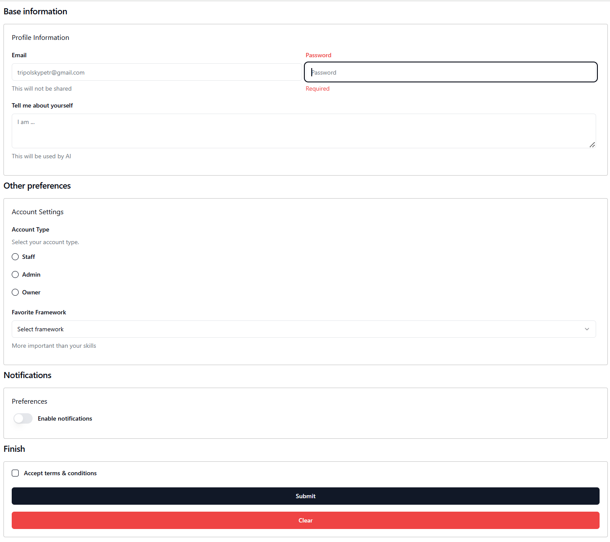

# ⚛️ react-declarative-shadcn

> The [shadcn ui kit](https://ui.shadcn.com/) bindings for [react-declarative](https://github.com/react-declarative/react-declarative/) 



## Getting started

```bash
npm install
npm start
```

## Code sample

```tsx
import { FieldType, One, TypedField } from "react-declarative";
import { FormGroup } from "@/components/ui/form";
import { Button } from "@/components/ui/button";

const frameworks = [
  {
    value: "next.js",
    label: "Next.js",
  },
  {
    value: "sveltekit",
    label: "SvelteKit",
  },
  {
    value: "nuxt.js",
    label: "Nuxt.js",
  },
  {
    value: "remix",
    label: "Remix",
  },
  {
    value: "astro",
    label: "Astro",
  },
];

const fields: TypedField[] = [
  {
    type: FieldType.Typography,
    typoVariant: "h4",
    placeholder: "Base information",
  },
  {
    type: FieldType.Outline,
    fieldBottomMargin: "1",
    fields: [
      {
        type: FieldType.Typography,
        typoVariant: "h6",
        placeholder: "Profile Information",
      },
      {
        type: FieldType.Text,
        validation: { required: true },
        name: "email",
        title: "Email",
        placeholder: "tripolskypetr@gmail.com",
        description: "This will not be shared",
        desktopColumns: "6",
        phoneColumns: "12",
      },
      {
        type: FieldType.Text,
        validation: { required: true },
        name: "password",
        title: "Password",
        placeholder: "Password",
        description: "Use a secure password",
        desktopColumns: "6",
        phoneColumns: "12",
      },
      {
        type: FieldType.Text,
        inputRows: 3,
        validation: { required: true },
        name: "bio",
        title: "Tell me about yourself",
        placeholder: "I am ...",
        description: "This will be used by AI",
        desktopColumns: "12",
      },
    ],
  },
  {
    type: FieldType.Typography,
    typoVariant: "h4",
    placeholder: "Other preferences",
  },
  {
    type: FieldType.Outline,
    fieldBottomMargin: "1",
    fields: [
      {
        type: FieldType.Typography,
        typoVariant: "h6",
        placeholder: "Account Settings",
      },
      {
        type: FieldType.Component,
        style: { width: "100%", marginBottom: "1rem" },
        element: () => (
          <FormGroup
            label="Account Type"
            description="Select your account type."
          />
        ),
      },
      {
        type: FieldType.Box,
        style: { width: "100%" },
        fields: [
          {
            type: FieldType.Radio,
            radioValue: "staff",
            title: "Staff",
            name: "account",
          },
          {
            type: FieldType.Radio,
            radioValue: "admin",
            title: "Admin",
            name: "account",
          },
          {
            type: FieldType.Radio,
            radioValue: "owner",
            title: "Owner",
            name: "account",
          },
        ],
      },
      {
        type: FieldType.Combo,
        name: "framework",
        title: "Favorite Framework",
        placeholder: "Select framework",
        description: "More important than your skills",
        itemList: frameworks.map(({ value }) => value),
        tr: (value) =>
          frameworks.find((f) => f.value === value)?.label || value,
        desktopColumns: "12",
      },
    ],
  },
  {
    type: FieldType.Typography,
    typoVariant: "h4",
    placeholder: "Notifications",
  },
  {
    type: FieldType.Outline,
    fieldBottomMargin: "1",
    fields: [
      {
        type: FieldType.Typography,
        typoVariant: "h6",
        placeholder: "Preferences",
      },
      {
        type: FieldType.Switch,
        title: "Enable notifications",
        name: "notify",
      },
    ],
  },
  {
    type: FieldType.Typography,
    typoVariant: "h4",
    placeholder: "Finish",
  },
  {
    type: FieldType.Outline,
    fieldBottomMargin: "1",
    fields: [
      {
        type: FieldType.Checkbox,
        title: "Accept terms & conditions",
        name: "agree",
      },
      {
        type: FieldType.Button,
        fieldRightMargin: "0",
        title: "Submit",
      },
      {
        type: FieldType.Component,
        element: () => (
            <Button variant="destructive">Clear</Button>
        )
      }
    ],
  },
];

export default function MainPage() {
  return <One fields={fields} sx={{ p: 1 }} />;
}

```
